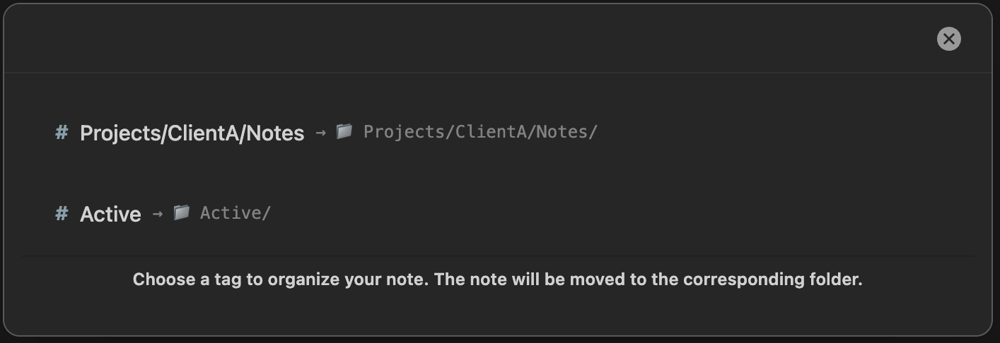
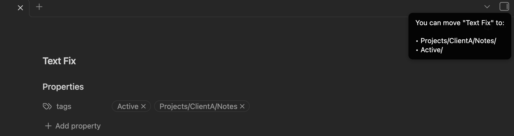
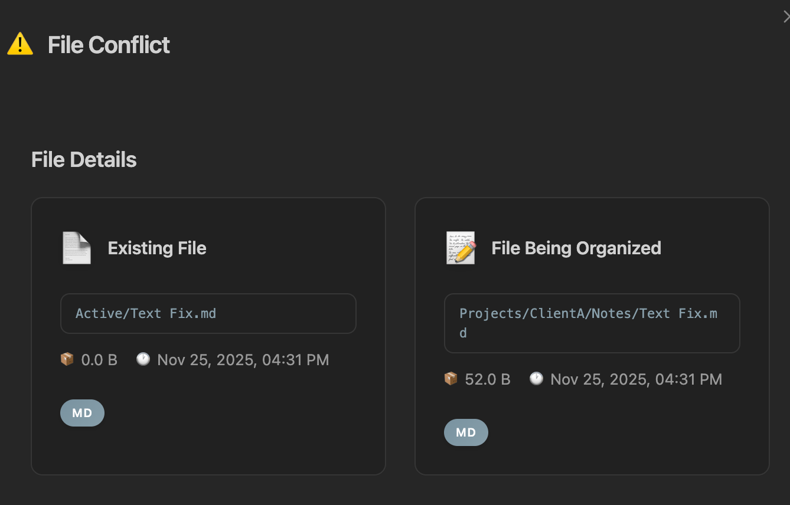
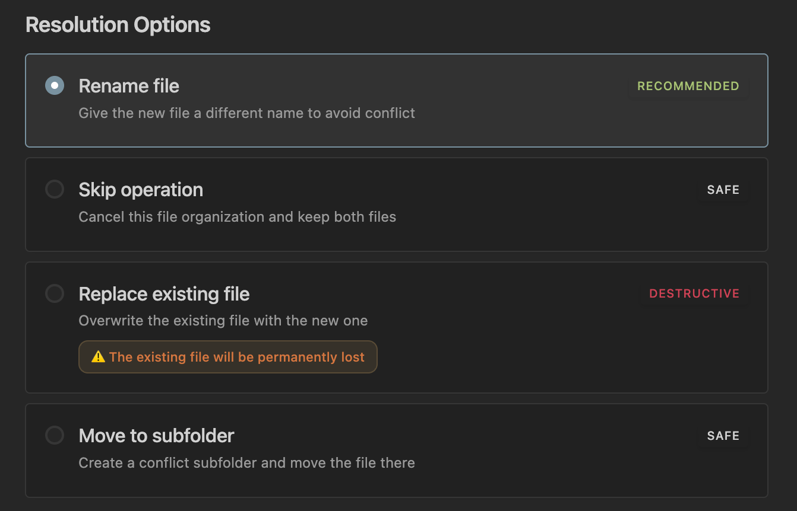
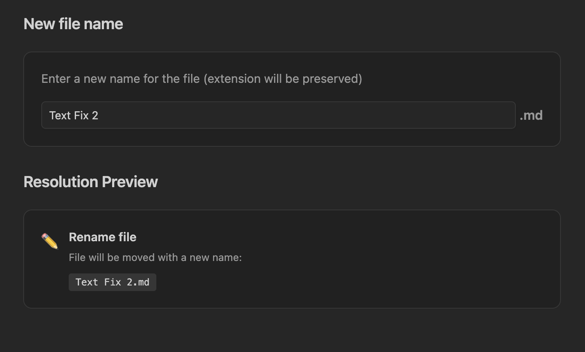

# Tag and Folders Plugin for Obsidian

[](https://github.com/SavaStone/TagAndFolders)

[](https://github.com/SavaStone/TagAndFolders)

A plugin for Obsidian that organizes notes into folders based on their tags. This initial version focuses on manual organization to ensure stability and gauge user interest before adding automated features in future releases.

## Overview

Tag and Folders helps you structure your Obsidian vault by moving notes into directories that match their tags. In this v1.0 release, organization is fully manual—you initiate every move to maintain complete control and avoid unexpected changes. Automatic organization (e.g., on note save or via batch processing) is planned for upcoming versions once I've minimized bugs and confirmed community demand.

Key highlights:
- 100% of the code was generated using Claude AI for coding assistance.
- Check out the plugin overview on my YouTube channel: https://youtu.be/tPrZNTrOnSg

The plugin detects various tag formats (YAML frontmatter, inline hashtags, and nested tags).

## Features

- **Manual Note Organization**: Manually move the current note to tag-based folders with a simple command.
- **Tag-to-Path Mapping**: Converts tags directly into folder paths (e.g., #project/work becomes /project/work).
- **Conflict Handling**: Interactive dialogs for resolving file name conflicts or duplicates, with options like rename or skip.
- **Preview Functionality**: View potential organization paths for a note before committing.
- **Easy Setup**: No configuration required out of the box.

Future plans include:
- Automated organization modes.
- Batch processing for multiple notes.
- Advanced filtering and rules.
- Reverse functionality: Automatically assign tags to notes based on their directory paths.

## User Stories

### Manual Organization of a Single Note
As an Obsidian user, I want to manually trigger the organization of my current note based on its tags, so I can organize my vault step-by-step without manual folder creation or drag-and-drop. In subsequent updates, automatic movement will be added for more seamless organization.

### Previewing Organization Options
As an Obsidian user, I want to see suggested folder paths for a note based on its tags, so I can decide if and where to move it.

## Installation

### Manual Installation
1. Download the latest release from the [Releases](https://github.com/SavaStone/TagAndFolders/releases) page.
2. Extract the files to your vault's `.obsidian/plugins/tag-and-folders/` directory.
3. Enable the plugin in Obsidian's settings under Community Plugins.

### Installation via BRAT
If you want to install directly from the GitHub repository (useful for accessing the latest changes or enabling automatic updates), you can use the Obsidian42 - BRAT plugin:

1. Ensure you have the BRAT plugin installed and enabled (search for "BRAT" in Obsidian's Community Plugins).
2. Open the BRAT settings in Obsidian.
3. Click "Add Beta Plugin" and paste the repository URL: `https://github.com/SavaStone/TagAndFolders`.
4. BRAT will handle the download and installation.
5. Enable the Tag and Folders plugin in Obsidian's Community Plugins settings.

## Usage

All main functions are accessed via the command palette (Ctrl/Cmd + P). You can set custom shortcuts for these commands in Obsidian's Hotkeys settings.

### Available Commands

- **Tag and Folders: Organize Current Note**: This command initiates the manual organization process for the currently open note. It scans the note's tags and presents a modal dialog with selectable options. Each option corresponds to one of the note's tags, displaying the tag (e.g., #Projects/ClientA/Notes) alongside the target folder path it maps to (e.g., Projects/ClientA/Notes/). You can choose a tag from the list, and upon confirmation, the note will be moved to the corresponding folder. The plugin automatically handles link updates, conflict resolution (via additional dialogs if needed), and backups during the process.

  

- **Tag and Folders: Show Organization Paths**: This command displays a side notification (toast message) previewing the potential folder paths where the current note can be moved, based on its tags. For example, it might show "You can move '[Note Title]' to:" followed by a list of paths like "Projects/ClientA/Notes/" or "Active/". This is a quick, non-intrusive way to check organization options without opening a full modal or committing to any changes—it simply informs you of possible destinations corresponding to the note's tags.

  

- **Tag and Folders: Test Tag and Folders Plugin**: This is a diagnostic command to verify that the plugin is installed and functioning correctly. It runs a quick internal test, which may log details to the console or display a confirmation message, useful for troubleshooting during setup or after updates.

To use any command:
1. Open a note that contains tags in Obsidian.
2. Press Ctrl/Cmd + P to open the command palette.
3. Search for the desired Tag and Folders command and select it.
4. Follow any on-screen prompts (e.g., for previews or confirmations).

## Conflict Resolution

If a file with the same name already exists in the target directory during a move, the plugin triggers a comprehensive File Conflict dialog to prevent data loss. This dialog provides detailed information and multiple safe resolution options, ensuring you have full control over how to proceed.

### File Conflict Dialog
The main conflict window displays side-by-side details of the conflicting files:
- **Existing File**: Shows the path (e.g., Active/Text Fix.md), file size (e.g., 0.0 B), modification date (e.g., Nov 25, 2025, 04:31 PM), and file type (e.g., MD).
- **File Being Organized**: Shows the proposed new path (e.g., Projects/ClientA/Notes/Text Fix.md), file size (e.g., 52.0 B), modification date, and file type.

This allows you to compare the files at a glance and make an informed decision.



### Resolution Options
Below the file details, you'll see a list of resolution strategies:



- **Rename file** (Recommended): Opens an input field to enter a new name for the file being moved (extension preserved, e.g., from "Text Fix" to something else). A "Resolution Preview" section shows exactly how the file will be renamed and moved (e.g., "renamed-file.md"). This avoids conflict without data loss.

  

- **Skip operation** (Safe): Cancels the current move operation, leaving both files unchanged and in their original locations. Ideal if you want to handle the conflict manually later.

- **Replace existing file** (Destructive): Overwrites the existing file with the one being moved. A prominent warning is displayed: "The existing file will be permanently lost." Use with caution, as this deletes the original file without recovery (though backups may be available via the plugin's backup system).

- **Move to subfolder** (Safe): Creates a new subfolder in the target directory (e.g., a "Conflicts" folder) and moves the file there, avoiding overwrite while keeping it organized.

These options are labeled with safety indicators (e.g., SAFE for non-destructive actions, DESTRUCTIVE for risky ones) to guide your choice.

After selecting an option and confirming, the plugin proceeds with the move, updates links if necessary, and creates a backup of the vault state for rollback.

## Development

### Prerequisites
- Node.js v16 or higher
- npm (or yarn/pnpm)
- Obsidian desktop for testing

### Setup
```bash
git clone https://github.com/SavaStone/TagAndFolders.git
cd "TagFolder Plugin"
npm install
npm run dev
```

## Guiding Principles

This plugin adheres to these core principles:
1. **User Control**: Start with manual operations to build trust and iterate based on feedback.
2. **Data Safety**: Prioritize link preservation and non-destructive actions.
3. **Simplicity**: Sensible defaults for immediate usability.
4. **Extensibility**: Designed for future automation without breaking existing workflows.
5. **Transparency**: Clear previews and dialogs for every action.

## Contributing

Contributions are welcome! To get started:
1. Fork the repo.
2. Create a branch: `git checkout -b feature/your-feature`.
3. Commit changes: `git commit -m 'Add your feature'`.
4. Push: `git push origin feature/your-feature`.
5. Open a Pull Request.

Please include tests for new features and follow the code style.

## License

MIT License - see [LICENSE](LICENSE) for details.

## Acknowledgments

- The Obsidian team for their excellent platform.
- Community users for inspiration and future feedback.
- Claude AI for assisting in code generation.