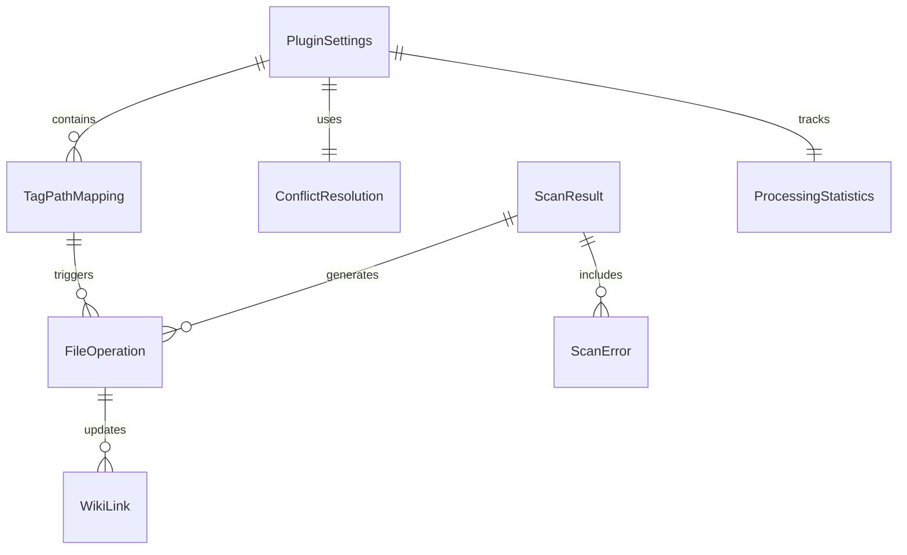

# Data Model - TagFolder Plugin

## Core Entities

### 1. TagPathMapping
Defines how tags map to folder paths.

```typescript
interface TagPathMapping {
  /** The tag to match (e.g., "#project" or "#project/active") */
  tag: string;
  /** Target folder path relative to vault root (e.g., "Projects/Active") */
  path: string;
  /** Priority for conflicting mappings (higher wins) */
  priority: number;
  /** Whether this mapping is active */
  enabled: boolean;
  /** When this mapping was created */
  createdAt: Date;
  /** When this mapping was last modified */
  modifiedAt: Date;
}
```

### 2. FileOperation
Represents a file organization operation.

```typescript
interface FileOperation {
  /** Unique identifier for this operation */
  id: string;
  /** Type of operation */
  type: 'move' | 'copy' | 'link-update';
  /** Source file path */
  source: string;
  /** Target file path */
  target: string;
  /** Tags that triggered this operation */
  tags: string[];
  /** Links that need updating */
  links: WikiLink[];
  /** Current status */
  status: 'pending' | 'in-progress' | 'completed' | 'failed' | 'skipped';
  /** Error message if failed */
  error?: string;
  /** Timestamp when operation was created */
  createdAt: Date;
  /** Timestamp when operation completed */
  completedAt?: Date;
}
```

### 3. WikiLink
Represents a link that needs to be updated.

```typescript
interface WikiLink {
  /** The file containing the link */
  sourceFile: string;
  /** The linked file's original path */
  originalTarget: string;
  /** The linked file's new path */
  newTarget: string;
  /** Link type */
  linkType: 'wiki-link' | 'markdown-link' | 'attachment';
  /** Line number where link appears */
  lineNumber: number;
  /** Column position on the line */
  column: number;
  /** Link text (for markdown links) */
  linkText?: string;
}
```

### 4. ConflictResolution
Defines how to handle file conflicts.

```typescript
interface ConflictResolution {
  /** The strategy to use */
  strategy: 'skip' | 'rename' | 'subfolder' | 'prompt';
  /** Reason for this resolution */
  reason: string;
  /** Additional context */
  context?: {
    /** Existing file path */
    existingFile: string;
    /** New file path */
    newFile: string;
    /** Available alternatives */
    alternatives?: string[];
  };
}
```

### 5. PluginSettings
Main plugin configuration.

```typescript
interface PluginSettings {
  /** Default conflict resolution strategy */
  defaultConflictResolution: ConflictResolution['strategy'];
  /** Files and folders to exclude from processing */
  exclusions: string[];
  /** Manual batch processing size */
  batchSize: number;
  /** Show progress notifications during manual operations */
  showProgress: boolean;
  /** Enable debug logging */
  debugLogging: boolean;
  /** Tag-to-path mappings for manual organization */
  tagMappings: TagPathMapping[];
  /** Manual processing statistics */
  statistics: ProcessingStatistics;
  /** UI preferences for manual dialogs */
  uiPreferences: {
    /** Show preview by default in manual operations */
    showPreviewByDefault: boolean;
    /** Prioritize specific tags in manual selection */
    prioritizeSpecificTags: boolean;
    /** Show advanced options in manual dialogs */
    showAdvancedOptions: boolean;
  };
}
```

### 6. ProcessingStatistics
Tracks plugin performance and usage.

```typescript
interface ProcessingStatistics {
  /** Total files processed */
  totalFilesProcessed: number;
  /** Files moved */
  filesMoved: number;
  /** Links updated */
  linksUpdated: number;
  /** Conflicts resolved */
  conflictsResolved: number;
  /** Errors encountered */
  errorsEncountered: number;
  /** Average processing time (ms) */
  averageProcessingTime: number;
  /** Last updated timestamp */
  lastUpdated: Date;
}
```

### 7. ScanResult
Result of a file system scan.

```typescript
interface ScanResult {
  /** Scan identifier */
  id: string;
  /** When scan started */
  startedAt: Date;
  /** When scan completed */
  completedAt?: Date;
  /** Total files scanned */
  totalFiles: number;
  /** Files with tags found */
  filesWithTags: number;
  /** Files needing organization */
  filesNeedingOrganization: number;
  /** Generated operations */
  operations: FileOperation[];
  /** Any errors during scan */
  errors: ScanError[];
  /** Scan status */
  status: 'running' | 'completed' | 'failed' | 'cancelled';
}
```

### 8. ScanError
Error encountered during scanning.

```typescript
interface ScanError {
  /** File path where error occurred */
  filePath: string;
  /** Error message */
  message: string;
  /** Error type */
  type: 'read-error' | 'parse-error' | 'permission-error' | 'other';
  /** When error occurred */
  timestamp: Date;
  /** Stack trace if available */
  stack?: string;
}
```

## Entity Relationships



## Data Validation Rules

### TagPathMapping
- `tag` must start with # and be valid tag format
- `path` must be valid relative path (no leading slash)
- `priority` must be >= 0

### FileOperation
- `source` and `target` must be valid file paths
- `type` must be one of allowed values
- `status` transitions must follow valid workflow

### WikiLink
- `sourceFile` and targets must exist in vault
- `lineNumber` and `column` must be >= 0
- `linkType` must be supported type

### PluginSettings
- `batchSize` must be between 1 and 1000
- `exclusions` must be valid glob patterns
- `tagMappings` must not have duplicate tags

## State Transitions

### FileOperation Status Flow
```
pending → in-progress → completed
pending → in-progress → failed
pending → skipped
```

### ScanResult Status Flow
```
running → completed
running → failed
running → cancelled
```

## Performance Considerations

### Indexing Strategy
- Maintain in-memory index of tag mappings for fast lookup
- Cache file scan results with TTL
- Use lazy loading for large file sets

### Memory Management
- Process files in batches to limit memory usage
- Clear operation history after completion
- Use streaming for large file processing

### Query Optimization
- Index files by tags for fast lookups
- Cache frequently accessed mappings
- Use efficient path matching algorithms

## Data Persistence

### Storage Locations
- **Plugin Settings**: Obsidian's data API
- **Tag Mappings**: JSON file in `.obsidian/plugins/tagfolder/`
- **Operation Logs**: Optional JSON log file
- **Statistics**: In-memory with periodic persistence

### Backup Strategy
- Manual backup prompts before major changes
- Export/import functionality for tag mappings
- Recovery mode for corrupted settings

## Security Considerations

### Path Validation
- Validate all file paths to prevent directory traversal
- Ensure operations stay within vault boundaries
- Sanitize user input for paths and tags

### Permission Checks
- Verify file permissions before operations
- Respect read-only file attributes
- Handle permission denied gracefully

## Migration Strategy

### Version Compatibility
- Schema versioning for configuration files
- Manual migration prompts for configuration changes
- Fallback behavior for incompatible configurations

### Data Import/Export
- JSON format for tag mappings
- CSV export for analysis
- Backup/restore functionality