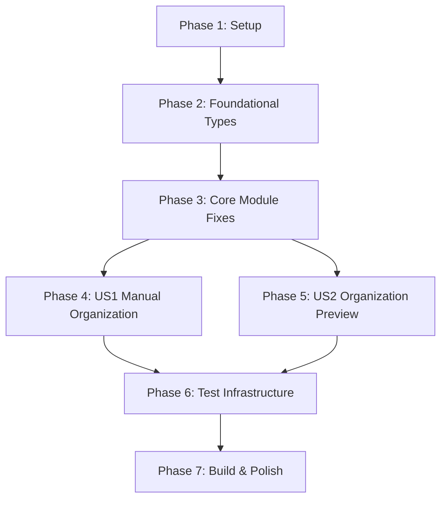

# Implementation Tasks - TagFolder Plugin Bug Elimination

**Feature**: TagFolder Plugin Manual Organization | **Branch**: 001-plugin-development-plan
**Spec**: [specs/001-plugin-development-plan/spec.md](specs/001-plugin-development-plan/spec.md)
**Generated**: 2025-11-19 | **Total Tasks**: 47 | **Current Errors**: 134 TypeScript compilation errors

## Phase 1: Setup & Bug Tracking Infrastructure (3 tasks)

**Goal**: Prepare bug elimination environment and establish systematic error tracking.

### Independent Test Criteria
- TypeScript error baseline established (134 errors)
- Bug tracking system operational
- Development environment compiles with current errors

### Implementation Tasks

- [ ] T001 Initialize development environment and verify dependencies
- [ ] T002 Set up TypeScript error tracking and baseline measurement (134 errors)
- [ ] T003 Create bug tracking spreadsheet for systematic resolution monitoring

## Phase 2: Foundational Type System Fixes (12 tasks)

**Goal**: Resolve core type definition issues that block compilation across all modules.

### Independent Test Criteria
- Core type definitions compile without errors
- Interface consistency achieved across modules
- Event system types properly aligned

### Implementation Tasks

- [ ] T004 Fix LinkUpdateConfig interface - add missing conflictResolution property in src/types/entities.ts
- [ ] T005 [P] Resolve statistical calculation type errors in src/file-ops/link-updater.ts (lines 162, 168)
- [ ] T006 [P] Fix LinkType return value mismatch in src/file-ops/link-updater.ts (line 534)
- [ ] T007 Fix LinkUpdateConfig vs LinkUpdaterSettings mismatch in src/manual/organizer.ts (line 96)
- [ ] T008 [P] Resolve LinkUpdaterSettings to LinkUpdateConfig conversion in src/manual/organizer.ts (line 236)
- [ ] T009 Fix optional property handling with exactOptionalPropertyTypes in src/manual/organizer.ts (lines 269-270)
- [ ] T010 Fix TagSelectionDialogOptions optional property type errors in src/manual/organizer.ts (line 278)
- [ ] T011 Resolve null/undefined handling in src/manual/organizer.ts (line 382)
- [ ] T012 Fix UpdateOptions vs UpdateOptions interface mismatch in src/manual/organizer.ts (line 441)
- [ ] T013 Add missing strategy property to ConflictResolutionResult in src/manual/organizer.ts (line 488)
- [ ] T014 Fix validation error type handling in src/scanning/path-mapper.ts (lines 116-117, 133-134, 148-152)
- [ ] T015 Fix PathMappingResult undefined handling in src/scanning/path-mapper.ts (line 224)

## Phase 3: Core Module Error Resolution (10 tasks)

**Goal**: Resolve type errors in core business logic modules.

### Independent Test Criteria
- Core modules compile without type errors
- Business logic type safety verified
- Module boundaries properly defined

### Implementation Tasks

- [ ] T016 [P] [US1] Fix tag scanner statistical calculation errors in src/scanning/tag-scanner.ts (lines 69, 100, 185)
- [ ] T017 [P] [US1] Add missing IFileScanner export in src/types/scanner.ts
- [ ] T018 [P] [US1] Fix event emission payload structure in src/scanning/tag-scanner.ts (line 172)
- [ ] T019 [P] [US1] Resolve validation array type assignments in src/scanning/path-mapper.ts (lines 316, 321)
- [ ] T020 [P] [US1] Fix file mover type inconsistencies in src/file-ops/file-mover.ts
- [ ] T021 [P] [US2] Resolve UI dialog type mismatches in src/ui/dialog.ts
- [ ] T022 [P] [US2] Fix tag selection dialog interface compliance in src/ui/tag-selection-dialog.ts
- [ ] T023 [P] [US2] Resolve conflict dialog result types in src/ui/conflict-dialog.ts
- [ ] T024 [P] [US1] Fix utility function type signatures in src/utils/validation.ts
- [ ] T025 [P] [US2] Resolve event system type consistency in src/utils/events.ts

---

## Phase 4: User Story 1 - Manual Organization Completion (8 tasks)

**Goal**: Complete manual organization workflow with full type safety and functionality.

**Independent Test Criteria**
- Manual organization dialog opens and functions correctly
- Tag detection works for all tag formats (YAML, inline, wiki-link)
- File movement and link updates complete successfully
- Conflict resolution dialog handles all scenarios
- Organization completes within 3 clicks (success metric validation)

### Implementation Tasks

- [ ] T026 [US1] Complete ManualOrganizer class type safety in src/manual/organizer.ts
- [ ] T027 [P] [US1] Ensure TagScanner handles all tag formats correctly in src/scanning/tag-scanner.ts
- [ ] T028 [P] [US1] Complete PathMapper tag-to-path conversion in src/scanning/path-mapper.ts
- [ ] T029 [P] [US1] Fix FileMover operation execution in src/file-ops/file-mover.ts
- [ ] T030 [P] [US1] Complete LinkUpdater for all link types in src/file-ops/link-updater.ts
- [ ] T031 [US1] Ensure TagSelectionDialog displays options correctly in src/ui/tag-selection-dialog.ts
- [ ] T032 [US1] Complete ConflictDialog with detailed information in src/ui/conflict-dialog.ts
- [ ] T033 [US1] Integrate manual organization workflow in src/core/plugin.ts

## Phase 5: User Story 2 - Organization Paths Preview (6 tasks)

**Goal**: Implement preview-only functionality for organization paths.

**Independent Test Criteria**
- Preview dialog displays possible organization paths
- Tag-to-path mapping shown clearly
- No file modifications occur during preview
- English UI text displayed correctly

### Implementation Tasks

- [ ] T034 [US2] Create preview functionality in ManualOrganizer in src/manual/organizer.ts
- [ ] T035 [P] [US2] Implement path preview dialog in src/ui/dialog.ts
- [ ] T036 [P] [US2] Ensure read-only operation in preview mode in src/scanning/path-mapper.ts
- [ ] T037 [P] [US2] Add preview-specific UI components in src/ui/file-preview.ts
- [ ] T038 [US2] Integrate preview command in plugin menu in src/core/plugin.ts
- [ ] T039 [US2] Add preview option to main plugin interface in src/main.ts

---

## Phase 6: Test Infrastructure & Performance (5 tasks)

**Goal**: Establish comprehensive testing infrastructure and validate performance requirements.

**Independent Test Criteria**
- All test suites compile and run without errors
- Obsidian API mocking complete and functional
- Performance benchmarks validate Constitution requirements
- Memory usage within 10MB idle limit

### Implementation Tasks

- [ ] T040 [P] Fix Obsidian API module resolution in test environment in tests/setup.ts
- [ ] T041 [P] Complete Obsidian API mocks for TFile/TAbstractFile hierarchy in tests/setup.ts
- [ ] T042 [P] Fix performance test module imports in tests/performance/tag-scanning.test.ts
- [ ] T043 [P] Complete memory usage test infrastructure in tests/performance/memory-usage.test.ts
- [ ] T044 [P] Fix unit test file reading mocks in tests/unit/tag-scanner.test.ts

---

## Phase 7: Build System & Polish (3 tasks)

**Goal**: Complete build system configuration and code quality improvements.

**Independent Test Criteria**
- Production build compiles without errors
- ESLint configuration runs without issues
- Prettier formatting applied consistently
- All source files follow coding standards

### Implementation Tasks

- [ ] T045 [P] Resolve final TypeScript compilation errors and achieve clean build
- [ ] T046 [P] Configure and run ESLint to fix code quality issues
- [ ] T047 [P] Apply Prettier formatting and ensure consistent code style

---

## Dependencies & Story Completion Order

### Story Dependencies
- **US1 (Manual Organization)**: Depends on Phase 2 & 3 completion
- **US2 (Organization Preview)**: Depends on Phase 2 & 3 completion
- **Test Infrastructure**: Depends on both US1 & US2 completion
- **Final Polish**: Depends on all previous phases

---

## Parallel Execution Opportunities

### Within Phase 2 (Foundational Types)
- **Parallel Group 1**: T005, T006, T007 (link-updater and organizer fixes)
- **Parallel Group 2**: T009, T010, T011 (organizer dialog and property fixes)
- **Parallel Group 3**: T014, T015 (path-mapper validation fixes)

### Within Phase 3 (Core Modules)
- **Parallel Group 1**: T016, T017, T018 (tag scanner fixes)
- **Parallel Group 2**: T019, T020, T021 (path-mapper, file-mover, dialog fixes)
- **Parallel Group 3**: T022, T023, T024, T025 (UI and utility fixes)

### Within Phase 4 & 5 (User Stories)
- **Parallel Group 1**: T027, T028, T029 (scanner, mapper, mover)
- **Parallel Group 2**: T030, T031, T032 (link updater, dialogs)
- **Parallel Group 3**: T034, T035, T036, T037 (preview functionality)

### Within Phase 6 (Test Infrastructure)
- **Parallel Group 1**: T040, T041 (test setup and mocks)
- **Parallel Group 2**: T042, T043, T044 (individual test fixes)

---

## Implementation Strategy

### MVP Scope (Phase 1-4)
Focus on achieving **User Story 1 completion** with:
- Core type system fixes (Phase 1-2)
- Manual organization workflow (Phase 3-4)
- Basic compilation without errors

### Incremental Delivery Approach
1. **Foundation First**: Establish type safety foundation
2. **Core Functionality**: Complete manual organization
3. **Preview Features**: Add organization preview capability
4. **Quality Assurance**: Comprehensive testing and validation
5. **Production Ready**: Build system and code quality

### Bug Resolution Strategy
- **Systematic Approach**: Fix errors in dependency order
- **Progress Tracking**: Monitor reduction from 134 → 0 errors
- **Validation**: Each phase must achieve clean compilation
- **Testing**: Validate functionality after each user story

### Success Criteria
- **Zero TypeScript compilation errors**
- **All user stories functional and tested**
- **Performance requirements met** (<1s tag scanning, <10MB memory)
- **Constitution v2.0.0 compliance maintained**
- **Production build successful**

---

## Task Summary by Category

| Category | Task Count | Estimated Effort |
|----------|------------|------------------|
| Setup & Bug Tracking | 3 | Low |
| Type System Foundation | 12 | High |
| Core Module Fixes | 10 | High |
| User Story 1 (Manual Org) | 8 | Medium |
| User Story 2 (Preview) | 6 | Medium |
| Test Infrastructure | 5 | Medium |
| Build & Polish | 3 | Low |
| **Total** | **47** | **High** |

**Critical Path**: T001 → T004 → T016 → T026 → T040 → T045
**Parallel Opportunities**: 23 tasks can be executed in parallel groups
**Independent Test Points**: 7 validation checkpoints throughout implementation

---

**Generated**: 2025-11-19
**Workflow**: SpeckIt Task Generation for Bug Elimination
**Compliance**: Constitution v2.0.0 (Manual-Only Organization)
**Target**: TagFolder Plugin for Obsidian
**Status**: Ready for systematic bug resolution execution